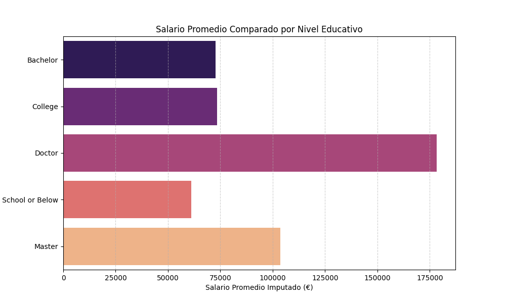
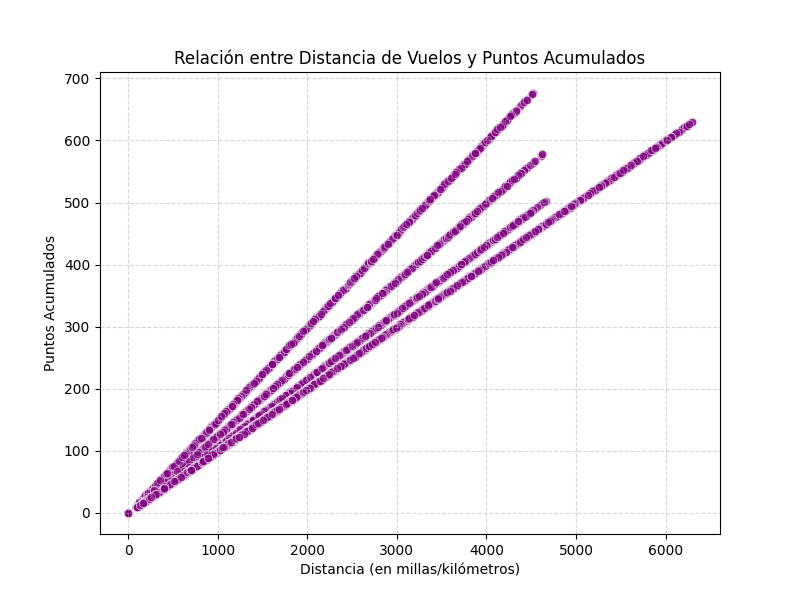

# bda-modulo-3-evaluacion-final-violetanys

✈️ Análisis de la Base de Clientes de Aerolínea:
## 📝 Descripción del Proyecto
Este repositorio contiene el análisis exploratorio de datos (EDA) y la limpieza del conjunto de datos de clientes de una aerolínea. El objetivo principal es preparar los datos para un modelado predictivo de alto valor y obtener información clave sobre la distribución, el comportamiento de vuelo y la demografía de la base de clientes.

## 🎯 Objetivos de Negocio
-> Entender la Demografía: Conocer la distribución de clientes por provincia, estado civil y nivel educativo.
-> Evaluar el Programa de Lealtad: Analizar la relación entre la actividad de vuelo y la acumulación de puntos.
-> Preparación de Datos: Crear un conjunto de datos limpio (datos_limpios.csv) listo para el modelado del Valor de Vida del Cliente (CLV).

## Herramientas y Dependencias
El proyecto se desarrolla en Python 3.13.7  
## Librerías:
Pandas y NumPy: Manipulación de datos y cálculos numéricos.

Matplotlib y Seaborn: Visualización de datos (Boxplots, Bar Charts, Heatmaps).

Otras librerías comunes de DS/ML.

## ✨ Metodología y Limpieza de Datos
El proceso de limpieza se centró en asegurar la integridad de las variables clave:

Imputación de Salarios: La columna Salary presentaba valores nulos (NaN) para clientes con nivel educativo 'College'. Se imputaron estos valores utilizando la mediana del salario de todos los demás clientes con el mismo nivel educativo, creando la columna Salary_Imputed.

Manejo de Valores Atípicos: Se realizó una revisión visual de los outliers y se confirmó la coherencia de las variables de actividad de vuelo.

Consistencia de Datos: Se estandarizaron o verificaron otras columnas como fechas y vuelos totales.

## 🔎 Principales Hallazgos del Análisis Exploratorio (EDA)

### 1. Salario y Nivel Educativo

Se confirma una relación positiva entre el nivel educativo y el salario promedio. Los clientes con niveles 'Master' y 'Doctor' tienen los salarios medios más altos. Esto se visualiza claramente en la distribución del salario:

### 2. Distribución Geográfica

La base de clientes está altamente concentrada en las provincias de Ontario, British Columbia y Quebec, lo cual se ve reflejado en el conteo de clientes:

### 3. Matriz de Correlación

La matriz de correlación completa revela la alta redundancia de información entre las variables de actividad de vuelo (`Distance`, `Total Flights`, etc.) y confirma que la correlación entre Salario y Vuelos es débil.

